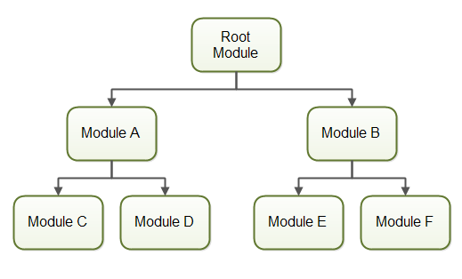

<div align="center">
    
</div>

# Concepts

The official documentation calls _webpack_ a static _module bundler_ for modern JavaScript applications. When _webpack_ processes a project, it basically does the following:

  1. recursively builds a _dependency graph_ that contains every module needed by the application

<div align="center">
    
</div>

  2. packages these modules into one or more _bundles_

To do this, _webpack_ relies heavily on the configuration which is based on the following **Core Concepts**:
  * [Entry](#entry)
  * [Output](#output)
  * [Loaders](#loaders)
  * [Plugins](#plugins)


## Entry

The **entry point** is the module which will be used by _webpack_ to start its processing. That is, where it will start building its _dependency graph_. From there, it will look for all the direct or indirect dependencies of the **entry point**.

### entry configuration

```javascript
module.exports = {
    entry: './path/to/entry_point.js'
};
```

See more ways of configuring [**Entry Points**](./02_Entry_Points.md).

## Output

The **output** dictates where _webpack_ will spew the _bundles_ it creates and how these files should be named.

### output configuration

```javascript
const path = require('path');

module.exports = {
    entry: './path/to/entry_point.js',
    output: {
        path: path.resolve(__dirname, 'dist'),
        filename: 'my-bundle.js'
    }
};
```

See more ways of configuring [**Output**](./03_Output.md).

## Loaders

**Loaders** allow _webpack_ to process more than just JavaScript files (since it only understands JS).

These **loaders** convert all kinds of files to valid modules that _webpack_ can process. That is, it transfoms any file into a module that can be included in the app's _dependency graph_ and eventually, the output bundle. Having **loaders** enables us to simply import any type of file in our app, as if they were modules.

They are defined by 2 properties:

1. `test` - identifies which files will be transformed
2. `use` - indicates which loader will be used to transform these files

### module.rules configuration

**Loaders** are configured in the `module.rules` property.

```javascript
const path = require('path');

const config = {
    entry: './path/to/entry_point.js',
    output: {
        path: path.resolve(__dirname, 'dist'),
        filename: 'my-bundle.js'
    }
    module: {
        rules: [
            { test: /\.txt$/, use: 'raw-loader' }
        ]
    }
};

module.exports = config;
```

This `rule` simply tells _webpack_ that whenever it encounters a path that resolves to a '.txt' file inside a `require()` or `import` statement, transform it using `raw-loader` before adding it to the bundle.


## Plugins

**Plugins** are loaders on steroids because they can perform a wider range of tasks. They can perform bundle optimization, minification, hot module replacement, and many more. Custom **plugins** can be implemented through the [_plugin interface_](https://webpack.js.org/api/plugins/).

### plugins configuration

To load a plugin to configuration, you should `require()` it and add it to the `plugins` property as an array element.


```javascript
const HtmlWebpackPlugin = require('html-webpack-plugin');
const webpack = require('webpack');
const path = require('path');

const config = {
    entry: './path/to/entry_point.js',
    output: {
        path: path.resolve(__dirname, 'dist'),
        filename: 'my-bundle.js'
    }
    module: {
        rules: [
            { test: /\.txt$/, use: 'raw-loader' }
        ]
    },
    plugins: [
        new webpack.optimize.UglifyJsPlugin(),
        new HtmlWebpackPlugin({template: './src/index.html'})
    ]
};

module.exports = config;
```

The first plugin in this config is a webpack built-in (see [list of built-in plugins](https://webpack.js.org/plugins/)).

The second one is a third-party plugin (see a [curated list of third-party plugins](https://github.com/webpack-contrib/awesome-webpack#webpack-plugins)).

## Conclusion

These are just the basic concepts. There is a lot more to cover.